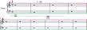

# Cursor for notes in a chord

We saw how to find the top and bottom of a system, and how notes from the source file were linked to the music sheet.
From that, getting the cursor for a chord is quite trivial: from the note file generated by the event listener, we
deduce which notes are played at which time. All notes of a chord are by definition played at the same time. Therefore,
notes being played at the same time are grouped together. From the note file, we extract the note id as the line and
file number from their spot in the source file. From there, we find where these notes are on the music sheets.
The cursor will then have as its left bound, the left-most limit of all notes in the chord. Similar for the right limit.
To find the top and bottom limit, we then need to find in which system they are, which is trivially done by comparing
coordinates.

It can happen that the bottom of a system stays below than the top of the next system, which means in some cases, a note
can look like it may belong to two different systems.

Below is an example showing when these can possibly happen.

The greyed area in the middle shows the overlap between the bottom of the top system and the top of the bottom system.
It illustrates that looking only to top and bottom system coordinates are sometimes not enough to determine to which
system a note belongs. However, for these notes, it is clear that using the full systems' skylines can be used to
accurately determine which system is the right one.

At this point, when playing the music, we can now also show the cursor ... and automatically scroll the page so that
the cursor is always visible near the middle of the screen.
