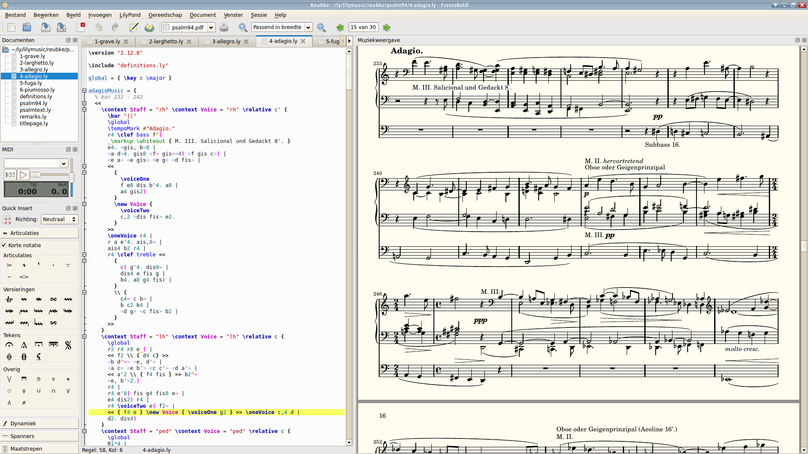

# Matching notes to where they appear on the music sheet.

Lilypond provides to a "point-and-click" feature. It is meant to facilitate writing music editors. For example, the
[Frescobaldi](http://frescobaldi.org/) software provides a music sheet view and a text editor view as can be seen
on the following screenshot:



when the user click on a note on the music sheet, the software automatically moves the cursor on the left side
to the corresponding place in the source file.

Therefore there is a way from matching a note on the music sheet to where the note was (line and column numbers)
in the input file. Now, when listening to events, the event listener outputed a listing lke the following

```
{{#include ./matching_a_note_to_where_it_appears_assets/simplest-unnamed-staff.notes}}
```

As can be seen, some lines contain `point and click` followed by two numbers. These are respectively the line
column number in the source file. And these lines are what was used to find out when to play a note. As a consequence,
this `point and click` can be used to correlate the place in the music sheet a note is, such that when a note
is to be played, it can also be graphically highlighted.

Now the idea is thus to extract all the "point and click" and their bounding boxes in all pages. Lilypond produces
pdf files by default, however parsing pdf files to extract this data proved to require significant efforts. Instead
of working with pdf files, I used another output format provided by lilypond: svg. Svg files are a special "kind"
of xml files and therefore can easily be analysed with a text editor or worked on with any XML parser.

To get lilypond to output svg files, one had to pass the `-dbackend=svg` option to lilypond. This will generate
one file per page, and to ensure lilypond generates these precious point-and-click elements, one has to also pass
the `-dpoint-and-click` option.

The result when doing so is an svg file containing cross link. For a note, the svg file will contain for example
```svg
<a style="color:inherit;" xlink:href="textedit:///tmp/simple_overlapping_notes.ly:36:17:18">
<path transform="translate(39.4689, 10.3826) scale(0.0028, -0.0028)" d="M211 141c61 0 117 -33 117 -100c0 -71 -52 -121 -99 -149c-34 -20 -73 -33 -112 -33c-61 0 -117 33 -117 100c0 71 52 121 99 149c34 20 73 33 112 33z" fill="currentColor"/>
</a>
```


From this, we can extract that the note that is written at line 36 from character 17 to 18 in the file
`/tmp/simple_overlapping_notes.ly` stays at position `39.4689, 10.3826` in the svg file. And to
compute the bounding box, we need to properly decode the content of the `d` field in the `path` element.
That last part requires significant effort. So instead, I went for a different method, albeit similar in
design. Lilypond provides ways to modify properties of graphical objects. When using the event-listener
it is possible to automatically modify the note head for all notes as they appear on the music sheet.
However we are not interested in modifying how the notes look like on the music sheet. What we want is to
extract the bounding boxes of notes in the music sheet. By abusing the `id` properties of notes, we can
achieve such a thing. The code in the event-listener looks as follow:

```scm
#(define (on-note-head engraver grob source-engraver)
   (let* ((context  (ly:translator-context source-engraver))
	  (event (event-cause grob))
       ...
	(ly:grob-set-property! grob 'id origin)
))


%%%% The actual engraver definition: We just install some listeners so we
%%%% are notified about all notes and rests. We don't create any grobs or
%%%% change any settings.

\layout {
  \override NoteHead.stencil = #(lambda (grob)
				  (let* ((note (ly:note-head::print grob))
					 (former-id (ly:grob-property-data grob 'id))
					 (x-interval (ly:stencil-extent note X))
					 (x-width (interval-length x-interval))
					 (y-interval (ly:stencil-extent note Y))
					 (y-height (interval-length y-interval))
					 (new-values (format #f "#x-width=~1,4f#y-height=~1,4f" x-width y-height))
					 (new-id (string-append new-values former-id)))
				    (ly:grob-set-property! grob 'id new-id)
				    note))

  \context {
    \Voice

    \consists #(make-engraver
		(acknowledgers
		 ((note-head-interface engraver grob source-engraver)
		  (on-note-head engraver grob source-engraver))))
  }
}
```

This code adds the origin of a note (the position in the source file) and also the x-width and y-height
of the note in svg into the note id. When running Lilypond with this, we now get something like
```svg
<g id="#x-width=.9284#y-height=.7971#origin=simple_overlapping_notes.ly:36:17:20#...">
<path transform="translate(39.4689, 10.3826) scale(0.0028, -0.0028)" d="M211 141c61 0 117 -33 117 -100c0 -71 -52 -121 -99 -149c-34 -20 -73 -33 -112 -33c-61 0 -117 33 -117 100c0 71 52 121 99 149c34 20 73 33 112 33z" fill="currentColor"/>
</g>
```

We can now extract that there is a note at position `39.4689, 10.3826` which spans for `0.9284, 0.7971` and that originates
from `simple_overlapping_notes.ly:36:17`. The position is actually the center of the note on the y axis, and the leftmost
position on the x axis. With this knowledge, computing the bounding box limits comes quite easy

Extracting all the `g` elements with an `id` field, and doing so for all svg files, we can now get where notes are displayed, and
identify them. And since that id is the same one as written in the note files (the output of the event listener), it is then
possible to match notes being played to where they are displayed.

Now there is an issue with unfold repeats here. If the user has some unfolded repeats in his source file, one note will appear
several time in the music sheet, but have only one distinct id (i.e. line and column number) in the source file. For these
cases, the software can't do the mapping and will therefore print an error message. A user can simply copy/paste the repeated
part as many times as required to provide the same graphical output while having one source note matching one note in the
music sheet. The same issue arises when a user uses variables and refer to them several times in the lilypond file.
